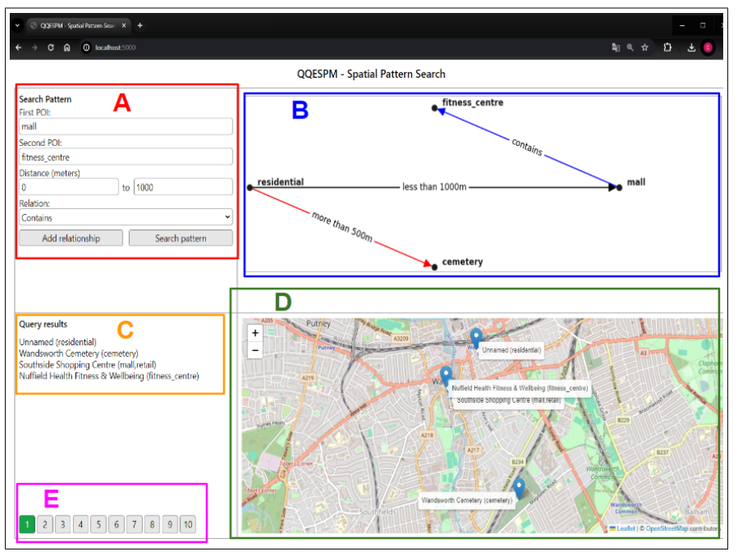

# QQESPM Web App
This repository provides a basic web application (with Flask) for enabling a graphical interface to perform QQ-SPM geo-textual queries. The QQ-SPM queries are useful for various spatio-textual search scenarios such as the search for Points of Interest (POIs) according to specific spatio-textual constraints. This type of query has been proposed and investigated in our scientic paper [QQESPM: A Quantitative and Qualitative Spatial Pattern Matching Algorithm](https://arxiv.org/abs/2312.08992) that described an efficient algorithm to solve such a query. The web tool hosted in this repository demonstrates the QQ-SPM query in action though a POI search scenario that employs the QQESPM algorithm in backend.

## Install the dependencies
pip install -r ./requirements.txt

## Start the backend 
python main.py

## Try a request
node create_request.js

pip uninstall matplotlib
pip install matplotlib==3.7.2
pip install networkx --upgrade

## Main screen
The image bellow shows a screenshot of this application, with descriptive rectangles separating the main areas of the screen:

